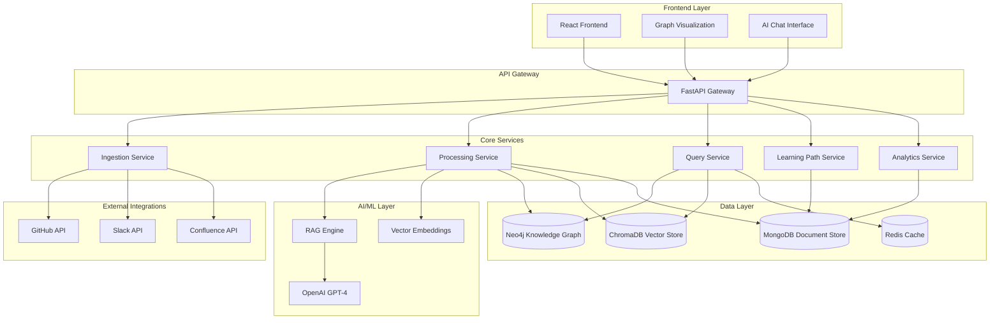

# Design Document

## Overview

Prism is designed as a microservices-based platform that automatically constructs and maintains a living knowledge graph from software development artifacts. The system uses a multi-layered architecture combining graph databases, vector search, and AI-powered natural language processing to provide intelligent developer onboarding and knowledge management.

The core innovation lies in the automated relationship mapping between code, documentation, people, and discussions, creating a comprehensive knowledge network that adapts to organizational changes and learns from developer interactions.

## Architecture

### High-Level Architecture



### Service Architecture

The system follows a microservices pattern with clear separation of concerns:

- **Ingestion Service**: Handles real-time data collection from external sources
- **Processing Service**: Performs AST parsing, NLP processing, and relationship extraction
- **Query Service**: Manages knowledge graph queries and vector searches
- **Learning Path Service**: Generates and manages personalized learning experiences
- **Analytics Service**: Tracks metrics and generates insights

## Components and Interfaces

### Ingestion Service

**Purpose**: Collect and normalize data from external sources

**Key Components**:
- `GitHubConnector`: Handles repository cloning, webhook processing, and incremental updates
- `SlackConnector`: Processes messages, threads, and file attachments with privacy controls
- `ConfluenceConnector`: Extracts documentation content and maintains version history
- `EventQueue`: Manages ingestion tasks with priority queuing and retry logic

**Interfaces**:
```python
class IngestionService:
    async def connect_repository(self, repo_url: str, access_token: str) -> ConnectionResult
    async def process_webhook(self, source: str, payload: dict) -> ProcessingResult
    async def sync_historical_data(self, connection_id: str, since: datetime) -> SyncResult
    async def get_connection_status(self, connection_id: str) -> ConnectionStatus
```

### Processing Service

**Purpose**: Transform raw data into structured knowledge graph entities

**Key Components**:
- `ASTParser`: Uses Tree-sitter to analyze code structure and extract relationships
- `NLPProcessor`: Processes natural language content using spaCy and custom models
- `RelationshipExtractor`: Identifies and creates relationships between entities
- `EmbeddingGenerator`: Creates vector representations using Sentence Transformers

**Interfaces**:
```python
class ProcessingService:
    async def process_code_file(self, file_content: str, language: str) -> CodeAnalysisResult
    async def extract_relationships(self, entities: List[Entity]) -> List[Relationship]
    async def generate_embeddings(self, content: str, content_type: str) -> VectorEmbedding
    async def update_knowledge_graph(self, updates: List[GraphUpdate]) -> UpdateResult
```

### Query Service

**Purpose**: Provide intelligent search and retrieval capabilities

**Key Components**:
- `GraphQueryEngine`: Executes Cypher queries against Neo4j with optimization
- `VectorSearchEngine`: Performs semantic similarity searches using ChromaDB
- `RAGPipeline`: Combines retrieval and generation for contextual answers
- `CacheManager`: Implements multi-layer caching strategy with Redis

**Interfaces**:
```python
class QueryService:
    async def semantic_search(self, query: str, filters: dict) -> List[SearchResult]
    async def graph_traversal(self, start_node: str, relationship_types: List[str]) -> GraphResult
    async def ask_question(self, question: str, context: dict) -> AIResponse
    async def find_experts(self, topic: str) -> List[Expert]
```

### Learning Path Service

**Purpose**: Generate and manage personalized learning experiences

**Key Components**:
- `PathGenerator`: Creates role-based learning sequences using graph algorithms
- `ProgressTracker`: Monitors completion and adapts paths based on performance
- `ContentRecommender`: Suggests relevant resources based on learning context
- `SetupScriptGenerator`: Creates automated environment setup procedures

**Interfaces**:
```python
class LearningPathService:
    async def generate_path(self, developer_profile: DeveloperProfile) -> LearningPath
    async def update_progress(self, user_id: str, module_id: str, completion_data: dict) -> ProgressUpdate
    async def adapt_path(self, user_id: str, performance_data: dict) -> PathAdaptation
    async def generate_setup_script(self, role: str, environment: str) -> SetupScript
```

### Analytics Service

**Purpose**: Track metrics and generate insights for continuous improvement

**Key Components**:
- `MetricsCollector`: Aggregates usage data and performance metrics
- `InsightGenerator`: Identifies patterns and knowledge gaps using ML algorithms
- `ReportGenerator`: Creates dashboards and progress reports
- `AlertManager`: Monitors system health and user progress anomalies

**Interfaces**:
```python
class AnalyticsService:
    async def track_interaction(self, user_id: str, interaction_data: dict) -> None
    async def generate_insights(self, time_range: TimeRange) -> List[Insight]
    async def get_team_metrics(self, team_id: str) -> TeamMetrics
    async def detect_knowledge_gaps(self, repository_id: str) -> List[KnowledgeGap]
```

## Data Models

### Core Entities

**Node Types in Knowledge Graph**:

```python
@dataclass
class CodeComponent:
    id: str
    name: str
    type: ComponentType  # class, function, module, etc.
    file_path: str
    start_line: int
    end_line: int
    language: str
    complexity_score: float
    last_modified: datetime
    deprecated: bool

@dataclass
class Person:
    id: str
    name: str
    email: str
    role: str
    expertise_areas: List[str]
    activity_score: float
    last_active: datetime

@dataclass
class Documentation:
    id: str
    title: str
    content: str
    source: str  # confluence, markdown, etc.
    url: str
    last_updated: datetime
    related_components: List[str]

@dataclass
class Discussion:
    id: str
    platform: str  # slack, github, etc.
    thread_id: str
    participants: List[str]
    topic: str
    timestamp: datetime
    resolved: bool
```

**Relationship Types**:

```python
class RelationshipType(Enum):
    IMPLEMENTS = "implements"
    DEPENDS_ON = "depends_on"
    DOCUMENTS = "documents"
    DISCUSSES = "discusses"
    MAINTAINS = "maintains"
    USES = "uses"
    EXTENDS = "extends"
    CALLS = "calls"
    IMPORTS = "imports"
    TESTS = "tests"
```

### Learning Path Models

```python
@dataclass
class LearningPath:
    id: str
    developer_id: str
    role: DeveloperRole
    experience_level: ExperienceLevel
    modules: List[LearningModule]
    estimated_duration: timedelta
    created_at: datetime
    adapted_count: int

@dataclass
class LearningModule:
    id: str
    title: str
    description: str
    prerequisites: List[str]
    learning_objectives: List[str]
    resources: List[Resource]
    estimated_time: timedelta
    difficulty_level: int
    completion_criteria: dict

@dataclass
class DeveloperProfile:
    id: str
    name: str
    email: str
    role: DeveloperRole
    experience_level: ExperienceLevel
    skills: List[str]
    interests: List[str]
    learning_preferences: dict
    progress: dict
```

## Error Handling

### Error Categories

**Integration Errors**:
- API rate limiting and quota management
- Authentication failures and token expiration
- Network connectivity issues and timeouts
- Data format inconsistencies and parsing errors

**Processing Errors**:
- AST parsing failures for unsupported languages or malformed code
- Vector embedding generation failures
- Knowledge graph constraint violations
- Memory and performance limitations

**User Experience Errors**:
- Query timeout handling with graceful degradation
- Incomplete or ambiguous search results
- Learning path generation failures
- Progress tracking inconsistencies

### Error Handling Strategy

```python
class ErrorHandler:
    async def handle_integration_error(self, error: IntegrationError) -> ErrorResponse:
        """
        Implements exponential backoff for transient failures
        Provides fallback data sources when primary sources fail
        Logs detailed error context for debugging
        """
        
    async def handle_processing_error(self, error: ProcessingError) -> ErrorResponse:
        """
        Queues failed items for retry with different strategies
        Provides partial results when possible
        Maintains system stability during high error rates
        """
        
    async def handle_user_error(self, error: UserError) -> ErrorResponse:
        """
        Provides helpful error messages with suggested actions
        Offers alternative approaches when queries fail
        Maintains conversation context despite errors
        """
```

### Resilience Patterns

- **Circuit Breaker**: Prevents cascade failures in external API calls
- **Bulkhead**: Isolates critical services from non-critical failures
- **Timeout**: Prevents resource exhaustion from slow operations
- **Retry with Backoff**: Handles transient failures gracefully
- **Graceful Degradation**: Provides reduced functionality when components fail

## Testing Strategy

### Dual Testing Approach

The system requires both unit testing and property-based testing to ensure correctness across the complex domain of knowledge management and AI-powered features.

**Unit Testing Focus**:
- Integration points with external APIs (GitHub, Slack, Confluence)
- AST parsing accuracy for different programming languages
- Vector embedding generation and similarity calculations
- Learning path generation algorithms
- Error handling and edge cases

**Property-Based Testing Focus**:
- Universal properties that must hold across all inputs
- Graph consistency and relationship integrity
- Search result relevance and ranking
- Learning path coherence and progression
- System performance under various load conditions

### Property-Based Testing Configuration

- **Library**: Hypothesis for Python components
- **Iterations**: Minimum 100 iterations per property test
- **Test Tagging**: Each property test references its design document property
- **Tag Format**: **Feature: prism, Property {number}: {property_text}**

### Testing Infrastructure

- **Continuous Integration**: Automated testing on all pull requests
- **Test Data Management**: Synthetic data generation for consistent testing
- **Performance Testing**: Load testing with realistic data volumes
- **Integration Testing**: End-to-end workflows with external service mocks

## Correctness Properties

*A property is a characteristic or behavior that should hold true across all valid executions of a system—essentially, a formal statement about what the system should do. Properties serve as the bridge between human-readable specifications and machine-verifiable correctness guarantees.*

### Property 1: AST Parsing Completeness
*For any* valid code repository in a supported language, the AST parser should successfully extract structural relationships for all parseable files without data loss
**Validates: Requirements 1.1**

### Property 2: Knowledge Graph Integrity
*For any* set of entities and relationships in the knowledge graph, all relationships should be bidirectional where appropriate, and updates to source data should propagate to all affected relationships consistently
**Validates: Requirements 1.4, 1.5**

### Property 3: Documentation Mapping Consistency
*For any* code component with associated documentation, the knowledge graph should maintain accurate bidirectional mappings that remain consistent across documentation updates
**Validates: Requirements 1.2**

### Property 4: Technical Discussion Linkage
*For any* technical discussion processed from Slack, relevant code components should be correctly identified and linked based on semantic content analysis
**Validates: Requirements 1.3**

### Property 5: Deprecation Detection Accuracy
*For any* codebase with explicit deprecation markers or usage patterns indicating deprecation, the system should correctly identify and flag all deprecated components
**Validates: Requirements 1.6**

### Property 6: Learning Path Generation Completeness
*For any* valid developer profile with specified role and experience level, the system should generate a complete learning path with appropriate prioritization, time estimates, and role-specific focus
**Validates: Requirements 2.1, 2.4, 2.5**

### Property 7: Progress Tracking Consistency
*For any* developer interaction or module completion, the system should accurately update progress state and unlock subsequent modules when prerequisites are satisfied
**Validates: Requirements 2.2, 6.1**

### Property 8: Adaptive Learning Path Adjustment
*For any* developer showing struggle patterns in learning modules, the system should provide appropriate adaptations such as additional resources or alternative approaches
**Validates: Requirements 2.3**

### Property 9: Historical Learning Optimization
*For any* set of historical completion data, the system should use this information to improve future learning path generation and adjust based on observed patterns
**Validates: Requirements 2.6**

### Property 10: RAG System Contextual Response
*For any* technical question asked by a developer, the RAG system should provide contextual answers that include relevant code snippets with accurate file locations and line numbers
**Validates: Requirements 3.1, 3.2**

### Property 11: Expert Identification Accuracy
*For any* technical question, the system should identify and recommend subject matter experts based on their demonstrated knowledge and activity in related code components
**Validates: Requirements 3.3**

### Property 12: Conversation Context Preservation
*For any* sequence of related questions in a conversation, the system should maintain context appropriately and improve responses based on user feedback
**Validates: Requirements 3.5, 3.4**

### Property 13: Documentation Reference Validity
*For any* answer that references documentation, all provided links should be valid, accessible, and point to the correct source materials
**Validates: Requirements 3.6**

### Property 14: Graph Visualization Color Coding
*For any* set of nodes displayed in the graph explorer, each node type should be consistently color-coded (code=blue, people=green, documentation=purple, discussions=yellow) and deprecated components should display warning indicators
**Validates: Requirements 4.2, 4.4**

### Property 15: Graph Interaction Responsiveness
*For any* user interaction with graph nodes (clicking, searching), the system should respond with appropriate detailed information, highlighting, and related connections
**Validates: Requirements 4.3, 4.5**

### Property 16: Environment Setup Script Generation
*For any* developer role and target environment, the system should generate appropriate setup scripts that include all necessary dependencies and validation steps
**Validates: Requirements 5.1, 5.4**

### Property 17: Setup Validation and Diagnostics
*For any* setup script execution, the system should validate successful installation and provide diagnostic information with suggested fixes when failures occur
**Validates: Requirements 5.2, 5.3**

### Property 18: Setup Script Maintenance
*For any* change in repository dependencies, setup scripts should be automatically updated to reflect the new requirements, and success rates should be tracked for improvement
**Validates: Requirements 5.5, 5.6**

### Property 19: Knowledge Gap Detection
*For any* pattern of multiple developers struggling with the same learning areas, the system should correctly identify and flag these as knowledge gaps
**Validates: Requirements 6.2**

### Property 20: Progress Report Completeness
*For any* generated progress report, it should include all required metrics: completion rates, time spent, and difficulty metrics
**Validates: Requirements 6.3**

### Property 21: Milestone Notification Delivery
*For any* developer completing onboarding milestones, appropriate team leads should receive notifications, and the system should generate improvement recommendations based on analytics
**Validates: Requirements 6.5, 6.6**

### Property 22: Real-time Integration Synchronization
*For any* connected external system (GitHub, Slack, Confluence), changes should be synchronized in real-time through webhooks or polling, while respecting API rate limits and privacy settings
**Validates: Requirements 7.1, 7.2, 7.3, 7.6**

### Property 23: Integration Resilience
*For any* API rate limit or credential expiration scenario, the system should handle the situation gracefully without data loss and provide appropriate notifications and recovery instructions
**Validates: Requirements 7.4, 7.5**

### Property 24: Vector Embedding Consistency
*For any* text content processed by the system, vector embeddings should be generated and maintained consistently, with updates propagated when new content is added
**Validates: Requirements 8.1, 8.4**

### Property 25: Semantic Search Accuracy
*For any* developer question, the system should use semantic similarity to find relevant content and rank results by relevance, supporting multilingual queries and functional code similarity
**Validates: Requirements 8.2, 8.3, 8.5, 8.6**

### Property 26: Authentication and Access Control
*For any* user access attempt, the system should authenticate using secure protocols and enforce access controls that match repository permissions, with immediate updates when permissions change
**Validates: Requirements 9.1, 9.2, 9.5, 9.6**

### Property 27: Security Audit Logging
*For any* access to sensitive information, the system should log access attempts appropriately for audit purposes while maintaining security
**Validates: Requirements 9.3**

### Property 28: Performance Under Load
*For any* concurrent user queries, the system should maintain response times under 2 seconds and use caching strategies to optimize performance as the knowledge graph grows
**Validates: Requirements 10.2, 10.3**

### Property 29: Auto-scaling Behavior
*For any* increase in system load, resources should scale automatically within configured limits while maintaining system functionality and monitoring performance metrics
**Validates: Requirements 10.5, 10.6**